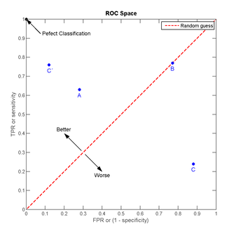

# 模型评价指标

　考虑一个二分问题，即将实例分成正类$\,(positive)\,$或负类$\,(negative)\,$。对一个二分问题来说，会出现四种情况。如果一个实例是正类并且也被 预测成正类，即为真正类$\,(true\,\, positive)\,$,如果实例是负类被预测成正类，称之为假正类$\,(false \,positive)\,$。相应地如果实例是负类被预测成负类，称之为真负类$\,(true\, negative)\,$,正类被预测成负类则为假负类$\,(false\, negative)\,$。

- $TP$：正确肯定的数目；
- $FN$漏报，没有正确找到的匹配的数目
- $FP$误报，给出的匹配是不正确的
- $TN$正确拒绝的非匹配对数；

如下表所示，1代表正类，0代表负类：

|         | 预测1  | 预测0  |
| :-----: | :--: | ---- |
| **实际1** |  TP  | FN   |
| **实际0** |  FP  | TN   |

## TPR、FPR和TNR

1. 真正类率 $TPR\,(true \,positive\,rate)$：刻画分类器所识别出的 正实例占所有正实例的比例
   $$
   TPR=\frac{TP}{(TP+FN)}
   $$

2. 负正类率 $FPR\,(false \,positive\,rate)$：分类器错认为正类的负实例占所有负实例的比例
   $$
   FPR=\frac{FP}{FP+TN}
   $$

3. 真负类率 $TNR\,(true\,negative\,rate)$：

   ​
   $$
   TNR=\frac{TN}{FP+TN}=1-FPR
   $$

## 精确率、召回率和$F1$

**精确率（正确率**和**召回率**广泛用于信息检索和统计学分类领域的两个度量值，用来评价结果的质量。其中精度是检索出相关文档数与检索出的文档总数的比率，衡量的是检索系统的**查准率**；召回率是指检索出的相关文档数和文档库中所有的相关文档数的比率，衡量的是检索系统的**查全率**。一般来说$Precision$就是检索出来的条目（比如：文档等）有多少是准确的，$Recall$就是所有准确的条目有多少被检索出来了，定义如下：

- $Precision=提取出的正确的信息数目/提取出的信息数目$
- $Recall=提取出的正确的信息数目/样本中的信息数目$

为了能够评价不同算法的优劣，$Precision$和$Recall$的基础上提出$F1$值的概念，来对$Precision$和$Recall$进行整体评价。$F1$的定义如下：
$$
F1=Precision * Recall * \frac{2}{Precision + Recall}
$$
某池塘有`1400`条鲤鱼，`300`只虾，`300`只鳖。现在以捕鲤鱼为目的，撒一大网，逮着`700`条鲤鱼，`200`只虾，`100`只鳖。那么这些指标分别如下：

- $Precision = \frac{700}{700 + 200 + 100}=70\%$
- $Recall = 700 / 1400 = 50\%$
- $F1 = 70\% * 50\% * 2 / (70\% + 50\%) = 58.3\%$

如果把池子里的所有的鲤鱼、虾和鳖都一网打尽，这些指标又有何变化：

- $Precision = \frac{1400}{1400 + 300 + 300}=70\%$
- $Recall = 1400 / 1400 = 100\%$
- $F1 = 70\% * 100\% * 2 / (70\% + 100\%) = 82.35\%$     

　　正确率是评估捕获的成果中目标成果所占得比例；召回率，就是从关注领域中，召回目标类别的比例；而$F1$则是综合这二者指标的评估指标，用于综合反映整体的指标。当然希望检索结果$Precision$越高越好，同时$Recall$也越高越好，但事实上这两者在某些情况下有矛盾的。比如极端情况下，只搜索出了一个结果，且是准确的，那么$Precision$就是$100\%$，但是$Recall$就很低；而如果把所有结果都返回，那么比如$Recall$是$100\%$，但是$Precision$就会很低。因此在不同的场合中需要自己判断希望$Precision$比较高或是$Recall$比较高。如果是做实验研究，可以绘制**Precision-Recall曲线**来帮助分析。

## $F-measure$ 

$Precision$和$Recall$指标有时候会出现的矛盾的情况，这样就需要综合考虑他们，最常见的方法就是$F-Measure$（又称为$F-Score$）。**F-Measure是Precision和Recall加权调和平均**：
$$
F_{measure} = \frac{(a^2+1)P*R}{a^2(P+R)}
$$
当参数$α=1$时，就是最常见的$F1$。因此$F1$综合$P$和$R$的结果，当$F1$较高时则能说明试验方法比较有效。

## ROC曲线和AUC

### why ROC？

1. 在一个二分类模型中，对于所得到的连续结果。假设已确定一个阀值，比如说$0.6$，大于这个值的实例划归为正类，小于这个值则划到负类中。如果减小阀值，减到$0.5$，固然能识别出更多的正类，也就是提高了识别出的正例占所有正例 的比类（即$TPR$），但同时也将更多的负实例当作了正实例，即提高了$FPR$。为形象刻画这一变化，引入$ROC$，$ROC$曲线可以用于评价一个分类器
2. 在类不平衡的情况下,如正样本`90`个,负样本`10`个,直接把所有样本分类为正样本,得到识别率为`90%`。但这显然是没有意义的。单纯根据$Precision$和$Recall$来衡量算法的优劣已经不能表达这种情况了。

### ROC

$ROC（Receiver \,Operating\, Characteristic）$曲线由两个变量$1-specificity$ 和$Sensitivity$绘制。$1-specificity=FPR$，即负正类率。$Sensitivity$即是真正类率，$TPR(True positive rate)$，反映了正类覆盖程度。这个组合以$1-specificity$对$sensitivity$，即是以代价$(costs)$对收益$(benefits)$。

 此外$ROC$曲线还可以用来计算“均值平均精度”$（mean average precision）$，这是通过改变阈值来选择最好的结果时所得到的平均精度$（PPV）$。如在医学诊断中,判断有病的样本。那么尽量把有病的揪出来是主要任务,也就是第一个指标$TPR$要越高越好。而把没病的样本误诊为有病的,也就是第二个指标$FPR$要越低越好。

不难发现这两者之间是相互制约的。如果某个医生对于有病的症状比较敏感,稍微的小症状都判断为有病,那么他的第一个指标应该会很高，但是第二个指标也就相应地变高。最极端的情况下，所有的样本都看做有病，那么第一个指标达到1，第二个指标也为1。以$FPR$为横轴，$TPR$为纵轴，得到如下$ROC$空间。

可以看出，**左上角的点**$(TPR=1,FPR=0)$，为完美分类，诊断全对。点$A(TPR>FPR)$医生$A$的判断大体是正确的。中线上的点$B(TPR=FPR)$，也就是医生$B$全都是蒙的，一半正确一半错误；**下半平面**的点$C(TPR<FPR)$，医生$C$的话我们要反着听，为真庸医。上图中一个阈值，得到一个点。现在需要一个独立于阈值的评价指标来衡量这个医生的医术如何，也就是遍历所有的阈值，得到$ROC$曲线。假设如下就是某个医生的诊断统计图，直线代表阈值。遍历所有的阈值，能够在$ROC$平面上得到如下的$ROC$曲线

曲线距离左上角越近，证明分类器效果越好。

如上是三条$ROC$曲线，在$0.23$处取一条直线。那么在$FPR=0.23$的情况下，红色分类器得到更高的$TPR$。也就表明，$ROC$越往上，分类器效果越好。

### AUC

**AUC值为ROC曲线所覆盖的区域面积，显然AUC越大，分类器分类效果越好**。$AUC = 1$是完美分类器，采用这个预测模型时，不管设定什么阈值都能得出完美预测。绝大多数预测的场合，不存在完美分类器。

- $0.5 < AUC < 1$：优于随机猜测，如果这个分类器（模型）妥善设定阈值的话，能有预测价值
- $AUC = 0.5$：跟随机猜测一样，模型没有预测价值
- $AUC < 0.5$：比随机猜测还差，但只要总是反预测而行，就优于随机猜测

　**AUC的物理意义：**假设分类器的输出是样本属于正类的$socre$（置信度），则$AUC$的物理意义为: 任取一对（正、负）样本，正样本的$score$大于负样本的$score$的概率。

### AUC计算

- 第一种方法：$AUC$为$ROC$曲线下的面积，直接计算面积即可。面积为一个个小的梯形面积之和，计算的精度与阈值的精度有关。
- 第二种方法：根据$AUC$的物理意义，计算正样本$score$大于负样本的$score$的概率。取$N*M$($N$为正样本数，$M$为负样本数)个二元组，比较$score$,，最后得到$AUC$，时间复杂度为$O(NM)$。
- 第三种方法：与第二种方法相似，直接计算正样本$score$大于负样本的概率。首先把所有样本按照$score$排序，依次用$rank$表示，如最大$score$的样本$rank=n\,(n=N+M)$，其次为$n-1$。那么对于正样本中$rank$最大的样本，$rank_{max}$，有$M-1$个其他正样本比他$score$小，那么就有$(rank_{max}-1)-(M-1)$个负样本比他$score$小。其次为$(rank_{second}-1)-(M-2)$。最后得到正样本大于负样本的概率为：

$$
\frac{\sum_{正样本}rank-M(M+1)/2}{N*M}
$$

​    时间复杂度为：$O(N+M)$

## 参考文献

[1. 常用指标](http://www.36dsj.com/archives/42271)

